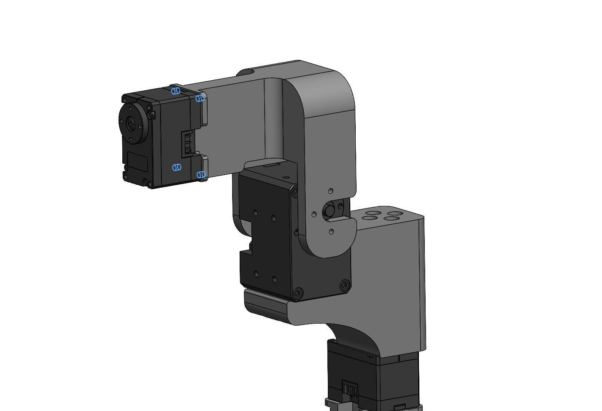

<h1> FACTR Low-Cost Force-Feedback Teleoperation Hardware</h1>

#### [Jason Jingzhou Liu](https://jasonjzliu.com)<sup>\*</sup>, [Yulong Li](https://yulongli42.github.io)<sup>\*</sup>, [Kenneth Shaw](https://kennyshaw.net), [Tony Tao](https://tony-tao.com), [Ruslan Salakhutdinov](https://www.cs.cmu.edu/~rsalakhu/), [Deepak Pathak](https://www.cs.cmu.edu/~dpathak/)
_Carnegie Mellon University_

[Project Page](https://jasonjzliu.com/factr/) | [arXiV](https://arxiv.org/abs/2502.17432) | [FACTR](https://github.com/RaindragonD/factr/) | [FACTR Teleop](https://github.com/RaindragonD/factr/)

<h1> </h1>
<div style="display: flex; gap: 10px; align-items: center;">
  
  
</div>

<br>


## Catalog
- [Bill of Materials](#bill-of-materials)
- [Building Instructions](#building-instrutions)
- [License and Acknowledgements](#license-and-acknowledgements)
- [Citation](#citation)


## Bill of Materials
<table>
  <thead>
    <tr>
      <th>Item</th>
      <th>Quantity</th>
      <th>Cost per Item</th>
      <th>Total Cost</th>
      <th>Note</th>
    </tr>
  </thead>
  <tbody>
    <tr>
      <td>Dynamixel XM430-W210-T Servo Motor</td>
      <td>2</td>
      <td>269.9</td>
      <td>539.8</td>
      <td><a href="https://www.robotis.us/dynamixel-xm430-w210-t/?srsltid=AfmBOoobcqrQwHHdHrSlQpemSoWhnFRndSfN0v7AKUanPUsymwRHg1OP">Purchase Link</a></td>
    </tr>
    <tr>
      <td>Dynamixel XC330-T288-T Servo Motor</td>
      <td>6</td>
      <td>89.9</td>
      <td>539.4</td>
      <td><a href="https://www.robotis.us/dynamixel-xc330-t288-t/?srsltid=AfmBOorRrAWvftzU-3zQruqD46WsC6kCz7jB14RhFxfvdM6v92H2eI7V">Purchase Link</a></td>
    </tr>
    <tr>
      <td>U2D2 Control PCB</td>
      <td>1</td>
      <td>32.1</td>
      <td>32.1</td>
      <td><a href="https://www.robotis.us/u2d2/?srsltid=AfmBOopG82m7F47C2HJT4Q9btluaBp5lSfk2BS-57h5wBO3lwNoY3PoJ">Purchase Link</a></td>
    </tr>
    <tr>
      <td>12V 20A Power Supply</td>
      <td>1</td>
      <td>24.99</td>
      <td>24.99</td>
      <td><a href="https://www.amazon.com/ALITOVE-Transformer-Switching-Converter-Security/dp/B078RTV41D/ref=sr_1_3?crid=LCJQ1V2TU0EB&dib=eyJ2IjoiMSJ9.Kxeyt91Idkbcjh1y_fQOAjghVZS97hMwZsH4yH1GieoZD_forxBJ-62ip1KKh9JL9R50_Nux_DVIU5crJvKceO14VzZkJC2G57tr63tQtc9sa6K-szQXQuRq5iG4ZjIDiRIbpYpDXZzkMoP7vCUyn6H3OWPANXVTb2ZOVNJNLK4zHJRjYjXpw0pCzSDdwAUOg07-qadvFRChFB-3dxqCqYDg-b9sBytRpJ0sqZHlWjA.4qeYQoE35kHmUwadwKLXvS3hRhdNbgZRytdsr3L_3hU&dib_tag=se&keywords=12V+20A+Power+Supply&qid=1743277220&sprefix=12v+20a+power+supply%2Caps%2C97&sr=8-3">Purchase Link</a></td>
    </tr>
    <tr>
      <td>FPX330-S102 Servo Bracket</td>
      <td>1</td>
      <td>8.7</td>
      <td>8.7</td>
      <td><a href="https://www.robotis.us/fpx330-s102-4pcs-set/">Purchase Link</a></td>
    </tr>
    <tr>
      <td>Polymaker PLA PRO Filament</td>
      <td>1</td>
      <td>24.99</td>
      <td>24.99</td>
      <td><a href="https://www.amazon.com/dp/B099KS2PDW?ref_=cm_sw_r_cp_ud_dp_9TYAHY4XBF45WRGQJGQ6">Purchase Link</a></td>
    </tr>
    <tr>
      <td>U2D2 Power Hub Board</td>
      <td>1</td>
      <td>19.99</td>
      <td>19.99</td>
      <td><a href="https://www.robotis.us/u2d2-power-hub-board-set/">Purchase Link</a></td>
    </tr>
    <tr>
      <td>14AWG Cable</td>
      <td>1</td>
      <td>23.99</td>
      <td>23.99</td>
      <td><a href="https://www.amazon.com/dp/B088RDY284?ref_=cm_sw_r_cp_ud_dp_4ESS07CK5QSXK185XQEP&th=1">Purchase Link</a></td>
    </tr>
    <tr>
      <td>3/4" Bearing</td>
      <td>1</td>
      <td>6.99</td>
      <td>6.99</td>
      <td><a href="https://www.amazon.com/4-Pack-Bearings-Carbon-Steel-Wheelbarrows/dp/B0CFDNP445/ref=sr_1_2?crid=3QXEH16NYBJGQ&dib=eyJ2IjoiMSJ9.jLM5L_XNofXQklP0kRHnPt8LGL6NuiKPEHHiVxTCyfUfOsQ5qNZ7GVdyFu1mDotvHbejkU1ovy6yEyvpFNjpWS1tf3fDiWFq0lLgVT_CcyzjF7vLIIKvLUbKS-6ok-9R1AXcctPpIOaShRQtsYmAKB_cU1WkcZ8W-ACOYvSg27uVsINf2k5rtAG9Ule0wtRNnivmLloOwH6rdGlLvfKIiV3ONQ3l1DMrCH5OdQ785Ak.pYQImWW40-qGdc7W5adEhTWtXsq7y0TBbNxKT9d6mvM&dib_tag=se&keywords=bearing%2B1%2F4%22%2Bwheelbarrow&qid=1743356760&sprefix=bearing%2B1%2F4%2Bwheelbarro%2Caps%2C211&sr=8-2&th=1">Purchase Link</a></td>
    </tr>
    <tr>
      <td>M2.5×8mm</td>
      <td>#</td>
      <td>N/A</td>
      <td rowspan="3">15.99</td>
      <td rowspan="3"><a href="https://www.amazon.com/NINDEJIN-Replacement-Computer-Miniature-Motherboard/dp/B08KXS2MWG/ref=sr_1_1_sspa?crid=2NVAZ4XAN3O2&dib=eyJ2IjoiMSJ9.zde0Rrsf9T_7G-uo4dB6ABc6Cjwvtn542RfotcCrKrvpyQYxphB2EbQjEGTwsP08d7CWl00KmjDuJVFQuNHbIIAsjCoZxKU18TIXQaUP0ppWkQ1_5fL0NkLm3Mh10ewzyIW7jZCWb1FwOIBS_z9TbihBJoMqb5w9ItBB6gfShFHpLh9SVrCVhgXAz1OMf267YAx96847NO0FVyXY-bVjf9nRCJ_H4A4Nu8NXlNcJuuOdfWL4aOTaJuMJ-JOWHS35A6DqghFqOu6hpEB25G5oNmd0JRcxPBfdSdNfHTtmDCE.izhqmXalArYdqS6Ag_oHXnGNkeLCB_QZmpLKuypHcD4&dib_tag=se&keywords=m2%2Bm2.5%2Bkit&qid=1743277446&s=industrial&sprefix=m2%2Bm2.5%2Bki%2Cindustrial%2C83&sr=1-1-spons&sp_csd=d2lkZ2V0TmFtZT1zcF9hdGY&th=1">Purchase link</a></td>
    </tr>
    <tr>
      <td>M2×10mm</td>
      <td>#</td>
      <td>N/A</td>
    </tr>
    <tr>
      <td>M2×6mm</td>
      <td>#</td>
      <td>N/A</td>
    </tr>
    <tr>
      <td>M2×8mm (Self Tapping)</td>
      <td>#</td>
      <td>N/A</td>
      <td rowspan="2">0</td>
      <td rowspan="2">Comes with Dynamixel XC330-T288-T Servo Motor</td>
    </tr>
    <tr>
      <td>M2×6mm (Self Tapping)</td>
      <td>#</td>
      <td>N/A</td>
    </tr>
    <tr>
      <td>M2×4mm</td>
      <td>#</td>
      <td>N/A</td>
      <td>0</td>
      <td>Comes with FPX330-S102 Servo Bracket</td>
    </tr>
    <tr>
      <td colspan="3"><b>Total</b></td>
      <td colspan="2"><b>1229.95</b></td>
    </tr>
  </tbody>
</table>


## Building Instructions

### Screw Guide

The FACTR Teleoperation Franka Leader Arm assembly requires six types of screws:

- **Screw A**: M2.5 × 8 mm  
- **Screw B**: M2 × 10 mm  
- **Screw C**: M2 × 8 mm (Self-tapping)  
- **Screw D**: M2 × 6 mm (Self-tapping)  
- **Screw E**: M2 × 6 mm  
- **Screw F**: M2 × 4 mm  

**Note:**  
- Screws **C** and **D** are included with the *Dynamixel XC330-T288-T* servos.  
- Screw **F** is included with the *FPX330-S102* servo bracket.


---

### Step 1: Configure the Power Supply
- Connect the **12V Power Supply** to the **U2D2 Power Hub Board**.  
- Connect the **U2D2 Control PCB** to the **U2D2 Power Hub Board**.


**Note:** Alternative ways of supplying power to the **U2D2 Control PCB** and the servos without using **U2D2 Power Hub Board** are available. 
Please refer to [here](https://emanual.robotis.com/docs/en/parts/interface/u2d2/) for more methods.

### Step 2: Update Servo IDs
By default, all Dynamixel servos are set to ID 1. To control multiple servos with a single U2D2 controller, 
each servo must be assigned a unique ID. This assignment should be done one servo at a time, starting with 
the servo closest to the robot base and progressing up the kinematic chain. Assign IDs sequentially from 
1 up to 8, with the gripper trigger servo holding ID 8. 

| Joint ID | Servo Type               |
|----------|--------------------------|
| 1        | Dynamixel XC330-T288-T   |
| 2        | Dynamixel XM430-W210-T   |
| 3        | Dynamixel XC330-T288-T   |
| 4        | Dynamixel XM430-W210-T   |
| 5        | Dynamixel XC330-T288-T   |
| 6        | Dynamixel XC330-T288-T   |
| 7        | Dynamixel XC330-T288-T   |
| 8        | Dynamixel XC330-T288-T   |

#### Steps to Change a Servo's ID:
1. **Connect a single servo to the U2D2 Power Hub Board.**
2. **Install and launch the [Dynamixel Wizard](https://emanual.robotis.com/docs/en/software/dynamixel/dynamixel_wizard2/) software.**
3. **Configure the scanning settings:**
   - In the top menu bar, go to **Tools → Options**.
   - Under **"Select port to scan"**, ensure all ports are selected.
   - Under **"Select baudrate to scan"**, choose the correct baudrate. The default is **57600 bps**. If unsure, select all available options.
   - Under **"Set ID range to scan"**, you can speed up scanning by limiting the range to **0–15**, unless the servo might already have an ID outside this range.
4. **Click the Scan icon** (magnifying glass with a gear) in the top-left corner.
   - If the servo is found, it will appear in the left panel of the window.
5. **Select the detected servo** from the panel, then click **ID** found in the middle panel of the window.
   - Select the new ID on the right panel of the window and click **Save**.
6. **Repeat** the above steps for each servo.


### Step 3: 3D Print the Body Links of the Leader Arm
The leader arm consists of **nine 3D-printed parts**. STL files for all components can be found in the `/3D_printing_files` directory.

- **Material**: PLA  
- **Infill**: 20%

To ensure accurate dynamic modeling, each printed part should closely match the specified mass values. These values correspond to the mass values 
defined in the provided URDF file. This URDF file is used to compute gravity compensation and other dynamics-related calculations.

The table below lists each part, its corresponding STL file, and its reference mass:

| Part Name              | STL File                                         | Mass (g) |
|------------------------|--------------------------------------------------|----------|
| Base Link              | factr_teleop_franka_base.STL                     | 150      |
| Link 1                 | factr_teleop_franka_l1.STL                       | 31       |
| Link 2                 | factr_teleop_franka_l2.STL                       | 19       |
| Link 3                 | factr_teleop_franka_l3.STL                       | 29       |
| Link 4                 | factr_teleop_franka_l4.STL                       | 28       |
| Link 5                 | factr_teleop_franka_l5.STL                       | 25       |
| Link 6                 | factr_teleop_franka_l6.STL                       | 12       |
| Gripper Handle         | factr_teleop_gripper_leader_handle.STL           | 21       |
| Gripper Trigger        | factr_teleop_gripper_trigger.STL                 | 5        |
| 3/4" Bearing           | N/A                                              | 39       |
| Dynamixel XM430-W210-T | N/A                                              | 84       |
| Dynamixel XC330-T288-T | N/A                                              | 23       |


### Step 4: Assemble the FACTR Teleop Franka Leader Arm
Follow the instructions below to assemble the leader arm, starting from the **base link** and progressing up to the **gripper teleoperation device**.

#### Base Link
Secure the **U2D2 Power Hub Board** on the **Base Link** and insert the **Bearing** as follows. 


Slide **Servo 1** such that its servo horn is concentric with the **Bearing**.


On the under-side of the **Base Link**, secure **Servo 1** with four **Screw B** screws. Connect **Servo 1** to the **U2D2 Power Hub Board**. 


#### Link 1
Insert **Link 1** fully into the bearing hole. Secure **Link 1** onto the servo horn of **Servo 1** using four **Screw C** screws.


Secure **Servo 2** onto **Link 1** using four **Screw A** screws. Connect **Servo 2** to the **U2D2 Power Hub Board**.

**Note:** For the purpose of this assembly tutorial, ensure the orientation of **Servo 2** matches that of the provided images,
where the side of the servo horn is facing the viewer. On the other side of **Servo 2**, also ensure that **Servo 2**'s idler is installed. 


#### Link 2
Slide **Link 2** onto the servo horn of **Servo 2** and secure it via seven **Screw E** screws.


Secure **Servo 3** onto **Link 2** with four **Screw B** screws. Connect **Servo 3** to **Servo 2**.

**Note:** Please ensure the orientation of the servo matches the image shown below.


#### Link 3
Secure **Link 3** onto the servo horn of **Servo 3** using four **Screw C** screws.

**Note:** If you choose to increase the force-feedback gain to enhance the force-feedback sensation, 
consider replacing **Servo 3**'s plastic servo horn to a 
[metal version](https://www.robotis.us/hnx330-n101-set/?srsltid=AfmBOop3pO_EHjoTXnjaf3ZWbRD_CDD0ClY2xiPG_qw5SiEay-YZPcLH).
The default plastic horn may be prone to failure under higher loads.
 


Secure **Servo 4** onto **Link 3** using four **Screw A** screws. Ensure **Servo 4**'s idler is installed.
Connect **Servo 4** to **Servo 3**.

**Note:** Please ensure the orientation of the servo matches the image shown below, with the side of te servo horn facing the viewer.


#### Link 4
Slide **Link 4** onto the servo horn of **Servo 4** and secure it via seven **Screw E** screws.


Secure **Servo 5** onto the **Link 4** using four **Screw B** screws. Connect **Servo 5** to **Servo 4**.




#### Link 5
Secure **Link 5** onto the servo horn of **Servo 5** using four **Screw C** screws.


Secure **Servo 6** onto **Linke 5** Using four **Screw B** screws. Install **Servo 6**'s idler. Connect
**Servo 6** to **Servo 5**.

**Note:** Please ensure the orientation of the servo matches the image shown below, with the side of te servo horn facing the viewer
and its idler facing away from the viewer.


#### Link 6
Slide **Link 6** onto the servo horn of **Servo 6** and secure it using eight **Screw D** screws.


Secure **Servo 7** onto **Link 6** using four **Screw B** screws. Connect **Servo 7** to **Servo 6**.


Secure **Servo Bracket** onto the servo horn of **Servo 7** using four **Screw F** screws.


#### Gripper Teleop Leader
Secure **Gripper Handle** onto **Servo Bracket** using four **Screw C** screws.


Slide **Servo 8** into **Gripper Handle** and secure it from the back using four **Screw C** screws.
Connect **Servo 8** to **Servo 7**.


Secure **Gripper Trigger** onto the servo horn of **Servo 8** using four **Screw C** screws.


**Note:** The gripper teleoperation leader presented here is a simplified and lighter update 
of the version shown in the figures of the paper.

#### Finished Assembly


## License and Acknowledgements
This source code is licensed under the Apache 2.0 liscence found in the LICENSE file in the root directory of this repository.

This project builds on top of or utilizes the following third party dependencies.
- [GELLO](https://wuphilipp.github.io/gello_site/): Inpiration for this work.


## Citation
If you find this codebase useful, feel free to cite our work!
<div style="display:flex;">
<div>

```bibtex
@article{factr,
  title={FACTR: Force-Attending Curriculum Training for Contact-Rich Policy Learning},
  author={Liu, Jason Jingzhou and Li, Yulong and Shaw, Kenneth and Tao, Tony and Salakhutdinov, Ruslan and Pathak, Deepak},
  journal={arXiv preprint arXiv:2502.17432},
  year={2025}
}
```